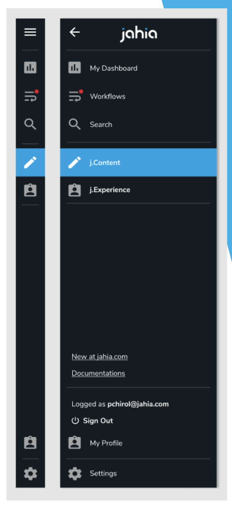

<!--
    Template for Readmes, see alternatives/examples here: https://github.com/matiassingers/awesome-readme
-->

<!--
    Project name can either be the full length project name (if there is one) or just the repo name. For example: Digital Experience Manager.
-->

# Jahia UI Root

<!--
    A one-liner about the project, like a subtitle. For example: Jahia Digital Experience Manager Core
-->

From version 8, Jahia is getting a new navigation, this repo contains the React App 

<!--
    A short technical description (not more than one paragraph) about the project, eventually with tech/tools/framework used.
-->

This new navigation was designed to rething the way our users navigate within Jahia. Two levels of navigation are available: Level 1 to navigation at a platform level, between apps and platform features, Level 2 to navigate within one of the app (jContent, jExperience). The navigation has been built to be extensible, adding elements to it by deploying modules. 

  

<!--
    Open Source badges, see https://shields.io/
-->

## Table of content

- [Presentation](#presentation)
- [Dev Environment](#dev-environment)
- [Build](#build)
- [Installation](#installation)
- [Links](#links)

<!--
    Not all sections are relevant for all projects. It's up to the team to decide what sections makes most sense. Objective of the readme is to serve as a technical introduction to faciliate onboarding for technical ppl (developers).
    License and contributions are detailed in their own files, no need to add too many details in the Readme.
    If the project has technical documentation stored in another location (such as a website), effort should be made not to duplicate content (since it will become outdated at some point). In that case, keep the readme instructions very brief (such as a set of CLI commands).
-->

## Presentation

<!--
    (Optional) Technical presentation of the project
-->

## Dev environment

<!--
    Instructions to help a new developer get its environment setup and understands contraints and dependencies and run tests
-->

## Build

<!--
    Instructions to build
-->

## Installation

<!--
    Instructions to install
-->

## Links

<!--
    Relevant links
-->
